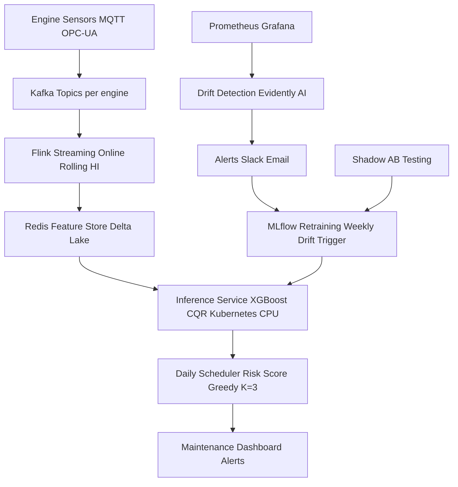

# Real-Time Predictive Maintenance System for Fleet Engines (NASA CMAPSS)

## Design Proposal

This production system transforms the offline model  into a scalable, low-latency, monitored, and continuously improving real-time service for a fleet operator. It handles streaming sensor data from hundreds/thousands of engines, computes features online, delivers uncertainty-calibrated RUL every cycle, and issues maintenance recommendations under capacity constraints (K slots/day).

---

## 1. Data Ingestion (Streaming Sensor Data)

- Real-time cycle-by-cycle sensor streams from engines via MQTT / OPC-UA / IoT gateways.
- Ingested into Apache Kafka topics (partitioned by engine ID for ordering).
- Exactly-once delivery + schema registry (Avro) + 7-day retention for replay.

---

## 2. Feature Computation (Online vs Batch)

**Online (primary path):**
- Apache Flink (or Spark Structured Streaming) with keyed state (by unit ID).
- Computes rolling windows (mean/std/slope/lags, window=15–30 cycles) and Health Index (HI) in real time.
- Uses pre-computed global min/max from training (stored in Redis) — zero leakage.

**Batch fallback:**
- Nightly Spark job for historical re-computation during retraining.
- Output stored in Redis (low-latency feature store) + Delta Lake for long-term archive.

---

## 3. Model Inference (Per Engine Per Cycle)

- Deployed as stateless Kubernetes microservice (CPU-only, ONNX or joblib format).
- Every cycle:
  - Fetch latest features from Redis.
  - Run Quantile XGBoost + CQR → P10/P50/P90 + calibrated 90% intervals.

- Latency: < 10 ms per engine.
- Auto-scaling based on active engine count.

---

## 4. Decision Service (Maintenance Recommendations)

- Daily (or real-time) Flink job runs the dynamic greedy scheduler (Task F logic).
- Inputs: risk score = CQR lower bound + interval width.
- Outputs: ranked list of engines to service today (respecting K slots + 15-cycle lead time).
- REST API (/recommend) + Grafana dashboard for mechanics.

---

## 5. Monitoring

- **Feature drift:** Evidently AI (KS test on HI distribution) vs training baseline — daily.
- **Model performance drift:** Track NASA score + CQR coverage on shadow predictions.
- **Rising failure risk:** Prometheus alert if >5% engines have risk_score > threshold.
- **Dashboards:** Grafana (risk heatmap, coverage trend, drift score).
- **Alerts:** Slack/Email on any drift > 5% or coverage drop below 85%.

---

## 6. Retraining Strategy & Evaluation

- **Trigger:** Weekly or on drift > 5% / coverage < 85%.
- **Process:** MLflow experiment tracking. New data ingested → retrain XGBoost + recalibrate CQR.

**Evaluation:**
- Shadow deployment: New model runs in parallel (no traffic). Compare simulated cost savings.
- A/B testing: Route 10% of engines to new model for 7 days → measure real cost + failure rate.
- Canary release with automatic rollback if NASA score worsens > 10%.

---

## Architecture Diagram

