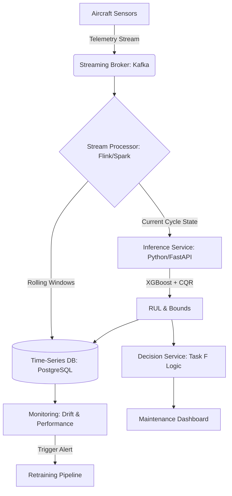

## 1. Production System Design 

Deploying this predictive maintenance pipeline requires transitioning from batch-processed `.txt` files to a continuous, fault-tolerant streaming architecture. The following proposal outlines the production environment required to ingest live telemetry, compute real-time uncertainty bounds, and drive operational decisions.

### 1.1. Architecture Diagram

### 1.2. Data Ingestion (Streaming Sensor Data)

Live sensor data from the aircraft fleet will be transmitted continuously to a message broker (e.g., Apache Kafka or AWS Kinesis). This decouples the ingestion layer from the processing layer, ensuring that sudden spikes in telemetry volume do not overwhelm the downstream inference services. The telemetry payload will contain the unit ID, cycle timestamp, and the raw sensor array.

### 1.3. Feature Computation (Online vs. Batch)

**Online Pipeline (Low Latency):**  
The 15-cycle rolling window features (means, standard deviations, and linear slopes) must be computed in real-time. A stream processing engine (Apache Flink or Spark Streaming) will maintain the state of the last 15 cycles in memory for each active engine, calculating the moving statistics the moment a new cycle arrives.

**Batch Pipeline (Historical State):**  
The raw and processed features are asynchronously sunk into a relational time-series database like PostgreSQL. This historical storage acts as the single source of truth for offline analytics, dashboarding, and future model retraining.

### 1.4. Model Inference (Per Engine, Per Cycle)

A dedicated Python microservice (built with FastAPI) will house the pre-trained MinMaxScaler, the Conformal Prediction penalty (q_hat), and the three XGBoost quantile models.

As the stream processor outputs a newly computed feature vector for a specific engine cycle, the inference service immediately scales the data, calculates the 5th, 50th, and 95th RUL percentiles, applies the CQR bounds, and outputs the final predictive interval.

### 1.5. Decision Service (Maintenance Recommendations)

The logic developed in Task F will run as a daily batch job (or triggered reactive service) evaluating the fleet's current state against hangar capacity ($K=3$).

- It queries the latest RUL predictions and uncertainty intervals for all active engines.
- It computes the Risk-Aware Urgency Score (penalizing highly uncertain engines).
- It pushes automated scheduling recommendations to the Maintenance Dashboard, actively alerting operations managers when an engine's predicted failure breaches the 15-day lead time threshold.

### 1.6. Monitoring & Alerting

**Feature Drift:**  
Monitoring tools (e.g., Evidently AI) will continuously compare the live distributions of critical sensors (e.g., physical fan speed, bypass ratio) against the training distributions. If a sensor degrades in a novel way, an alert is triggered.

**Model Performance Drift:**  
Because true RUL is only known after an engine is removed and inspected, delayed ground-truth labels will be fed back into the system to calculate ongoing empirical coverage and Winkler scores.

**Rising Risk Alerts:**  
If an engine's 5th percentile lower-bound suddenly plummets, an automated, high-priority alert bypasses the standard daily scheduling queue and immediately pages the reliability engineering team.

### 1.7. Retraining Strategy & Shadow Deployment

When significant feature drift is detected, the model must be updated safely.

**Retraining:**  
A pipeline orchestrated by Airflow will pull the latest historical data from PostgreSQL, retrain the XGBoost models, and recalculate the Conformal Prediction penalty.

**Evaluation via Shadow Deployment:**  
In aviation, deploying a flawed model can result in catastrophic physical failures. A simple A/B test is too risky. Instead, new candidate models will be deployed in "Shadow Mode." They will ingest live telemetry and generate predictions alongside the production model, but their outputs will not interact with the Decision Service. Once the candidate model statistically proves superior performance and stable bounds over a defined monitoring period, it will be safely promoted to production.
